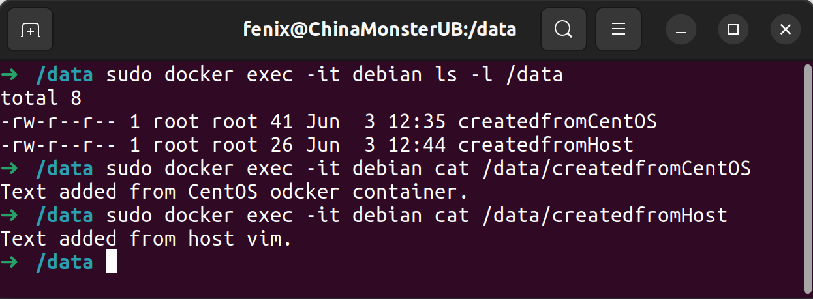

### Задача 1.  
#### Usage  
sudo docker run -d -p 8080:80 fenixad/netology:i_am_devops  
http://localhost:8080  

### Задача 2.  
На мой взгляд, для разных компонентов сценария стоит использовать разную инфраструктуру. 
ВМ или физические серверы для монолитного Java веб-приложения, MongoDB хранилища, Gitlab и приватного Docker Registry.  
Для остальных, кроме мобильного приложения с версиями для Android и iOS, скорее всего, подойдет Docker.  
Не совсем понял что имеется в виду под мобильным приложением с версиями для Android и iOS. Если некое хранилище артефактов, наверное, лучше подойдет ВМ, если бэкенд, зависит от архитектуры, возможны варианты и с контейнерами.  

### Задача 3.  
Создаем директорию:  
sudo mkdir /data  
Запуск контейнера CentOS (используем полный путь /data, иначе docker создаст volume в дебрях своих служебных директорий):  
sudo docker run --name centos -d -t -v /data:/data centos  
Создаем текстовый файл внутри CentOS:  
sudo docker exec -it centos bash  
vi /data/createdfromCentOS  
exit  
Добавляем еще один файл с хоста:  
sudo vi /data/createdfromHost  
Запуск контейнера debian и подключение к нему по тому же принципу:  
sudo docker run --name debian -d -t -v /data:/data debian  
sudo docker exec -it debian bash  
Или просто:  
sudo docker exec -it debian ls -l /data  
sudo docker exec -it debian cat /data/createdfromCentOS  
sudo docker exec -it debian cat /data/createdfromHost  

