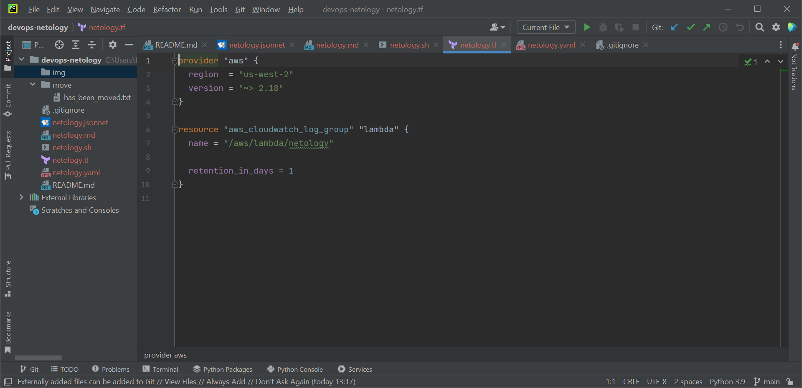
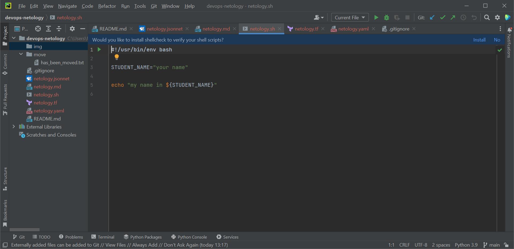
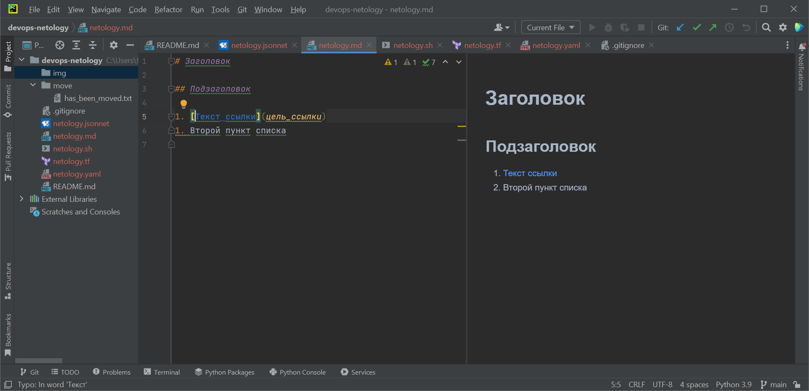
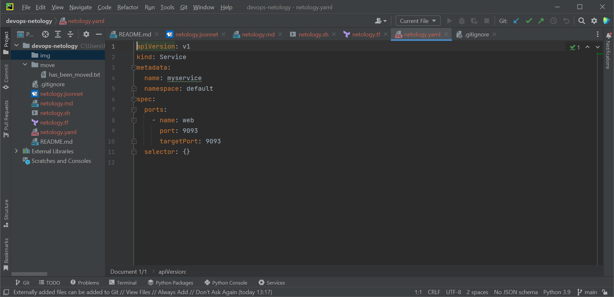
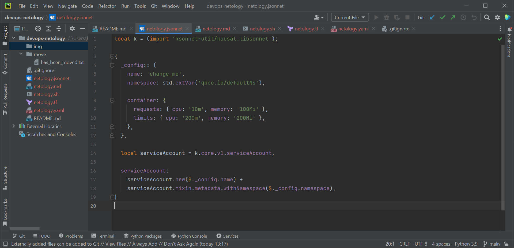

# devops-netology

**Подсветка и пруфы**. Работает, картинки ниже:

* Terraform: 
* Bash: 
* Markdown: 
* Yaml: 
* Jsonnet: 

# .gitignore

Will be ignored:

Directories named .terraform in repo`s root or any nested.

Files with tfstate in name or extension.

File crash.log or crash.*.log

File with tfvars or tfvars.json extension.

Files named override.tf, override.tf.json or with _override.tf, _override.tf.json in name.

File terraform.rc or with terraformrc extension.

And .idea folder additionally. New commit from PyCharm.

Experiment
Need more lines
MOOORE LINES!!!!11

