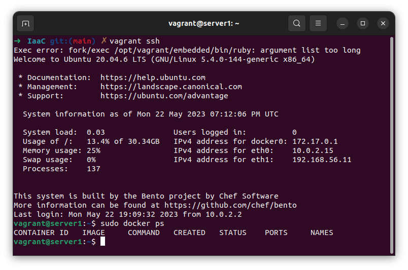

### Задача 1.

Основные преимущества применения на практике IaaC-паттернов:  
- ускорение разработки и выхода продукта на рынок;    
- стабильность и воспроизводимость кофигураций.  
Основополагающий принцип - идемпотентность: одинаковый результат и состояние объекта при первом или любом последующем выполнении операции.

### Задача 2.

Ansible выгодно отличается от остальных систем управления конфигурациями более низким порогом входа, простотой установки и настройки, высокой скоростью работы и широкими возможностями расширяемости.  
На мой взгляд, push метод работы системы управления конфигурациями более надежный и удобный. С его помощью можно в любой момент запустить исполнение задачи и, например, получить актуальный статус управляемых узлов.  

### Задача 3.  
#### VirtualBox  
`➜  devops-netology git:(main) ✗ VBoxManage -v  
6.1.38_Ubuntur153438`

#### Vagrant  
`➜  devops-netology git:(main) ✗ vagrant -v  
Vagrant 2.3.4`

#### Terraform  
`➜  devops-netology git:(main) ✗ terraform -v     
Terraform v1.4.6`

#### Ansible
`➜  devops-netology git:(main) ✗ ansible --version  
ansible [core 2.14.5]`

### Задача 4.

